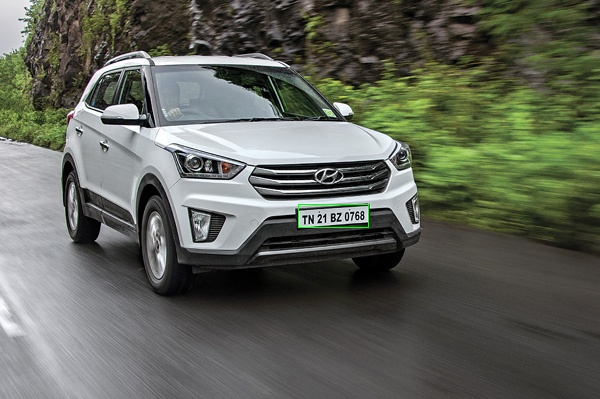
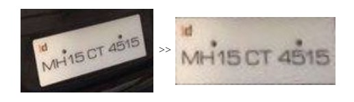
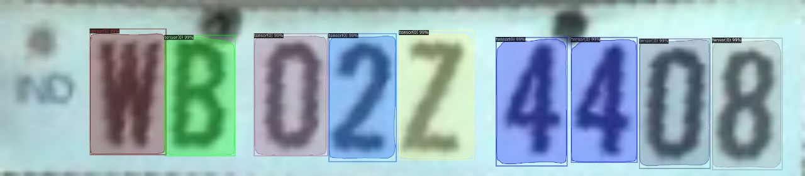
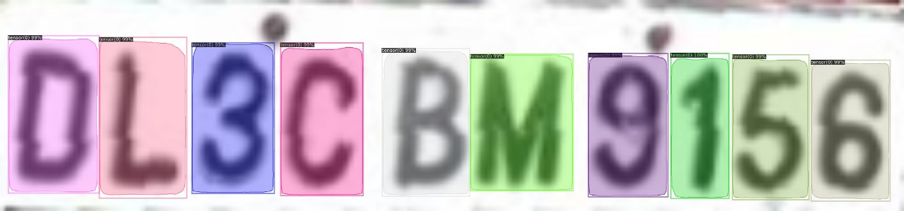
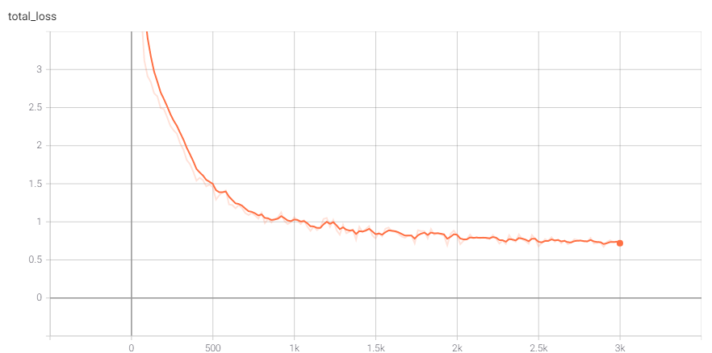
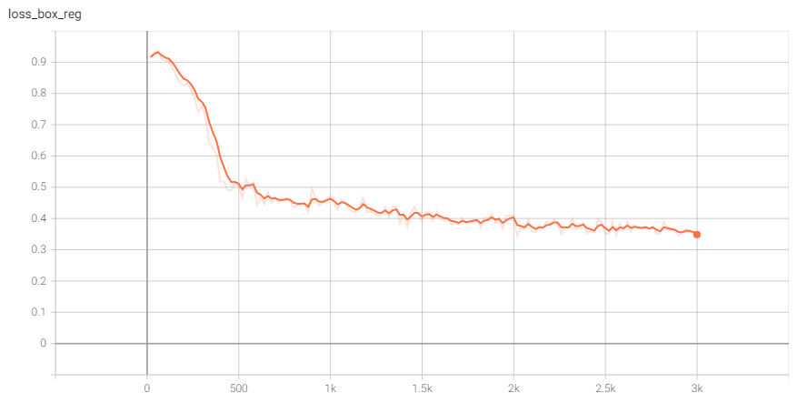
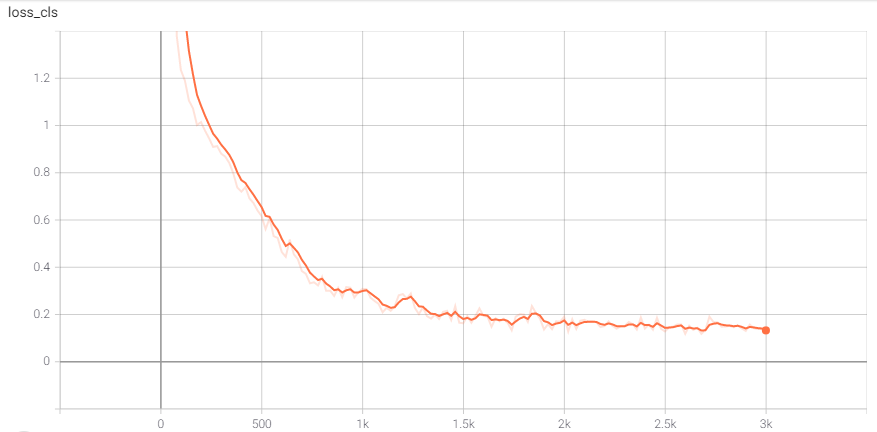

# Automatic License Plate recognition

A robust solution to license plate recognition task in unconstrained conditions.

* [Installation](#Installation)
* [Usage](#Usage)
* [Approach](#Approach )
* [Training](#Training)
* [Team](#Team)
* [Conclusion](#Conclusion)
* [References](#References)


## Installation

```sh
# install dependencies: 
pip install -r requirements.txt
pip install pyyaml==5.1


# install detectron2: 
pip install detectron2 -f https://dl.fbaipublicfiles.com/detectron2/wheels/cu101/torch1.8/index.html
```

As the weights of network are huge in size they are not included in this repo, one can find them [here](https://drive.google.com/file/d/1ap9npAmNW7B5kuHbgJrPDz4LWNzfkvEC/view?usp=sharing).

## Usage

Here is an example to run inference on images that includes just plates : 

```python
import cv2
from main import * # This includes functions required to run inference on test images

images_path = ["plate1.png", "plate2.png"]

for filename in images_path:
    
    image = cv2.imread(filename)
    PlateRecognition(image)
```

Here is an example to run inference on images that includes cars (can also include multiple cars) : 

```python
from main import * # This includes functions required to run inference on test images

images_path = ["car1.png", "car2.png"]

for filename in images_path:
        
    from_car(filename)
```

Here is an example to run inference on a video : 

```python
from main import * # This includes functions required to run inference on test images

filename = "test_video.mp4"
from_video(filename)
```

## Approach

Here is a brief explanation of our approach. Our approach can be divided into three parts :

1) License Plate detection

2) Perspective transformation of LP

3) Segmentation and recognition of characters

### License Plate detection	

For license plate detection, we used Yolo v3, a variant of Darknet, which originally is a 53 layer network, we used the inference code and weights from this [repo](https://github.com/alitourani/yolo-license-plate-detection). Yolo performed so well on multiple car images but it was missing number plates of distant cars. So along with this we included another object detection model WPOD-NET, in order to increase the robustness of our solution and we used the inference code and weights from this [repo](https://github.com/quangnhat185/Plate_detect_and_recognize). Also because of its smaller size as compared to yolo it didn’t have much effect on efficiency of license plate detection tasks.

<div align="center">
    
    <p><i><small>You can see an example of LP detection here.</small></i></p>
</div>


### Perspective transformation of LP

After the first step, we are left with an image of license plate which might contain a tilted or warped license plate. So we now perform the four-point perspective transformation on the image by assuming the background of the license plate is lighter than the text written on it.

<div align="center">
    
    <p><i><small>You can see an example of perspective tranformation here.</small></i></p>
</div>


###  Segmentation and recognition

In order to perform segmentation and recognition on cropped license plate, we used Detectron 2, Facebook AI Research's next generation library that provides state-of-the-art detection and segmentation algorithms. We used Mask R-CNN R50-FPN variant which is generally used for instance segmentation and classification.

To train the detectron network we created our own dataset of 550 images which contains around 5000 characters labelled. So the output of the detectron network will be the bounding boxes around the characters in images and their class.

<div align="center">
    
    
    <p><i><small>You can see some examples of segmentation and classification of characteres.</small></i></p>
</div>


## Training

Detectron 2 is widely used because of its speed in training and inference, the classification loss, and the bounding-box regression loss converged just after training for a few minutes. We chose Mask R-CNN R50-FPN variant and trained it using transfer learning with initial weights trained on COCO dataset.

<div align="center">
    
    
    
    <p><i><small>These are the training curves for Bounding box regression loss, classification loss and total loss.</small></i></p>
</div>

## Team

|  |  |  |
| ------------------------------------------------------------ | ------------------------------------------------------------ | ------------------------------------------------------------ |
| [Ananya Singh](https://github.com/ananya130)                 | [Payal Umesh Pote](https://github.com/payal116)              | [Vishwas Chepuri](https://github.com/vstark21)               |

## Conclusion

* Time taken to run inference on Nvidia Tesla K80 GPU is 2 sec per image and on CPU is 5 sec per Image.

* Our pipeline can be deployed to work in real time.
* Among all the opencv approaches we tried and came across, none was promising and as reliable as deep learning for segmentation task.

## References

* [Detecting and Reading vehicle's license plate from various countries ](https://github.com/quangnhat185/Plate_detect_and_recognize)
* [A License-Plate detection application based on YOLO](https://github.com/alitourani/yolo-license-plate-detection)
* [License Plate Detection and Recognition in Unconstrained Scenarios](https://openaccess.thecvf.com/content_ECCV_2018/papers/Sergio_Silva_License_Plate_Detection_ECCV_2018_paper.pdf)
* [Character Recognition and Segmentation For Custom Data Using Detectron2](https://towardsdatascience.com/character-recognition-and-segmentation-for-custom-data-using-detectron2-599de82b393c)